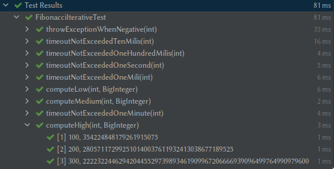
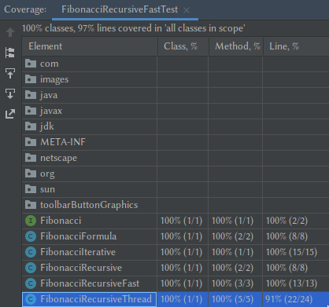
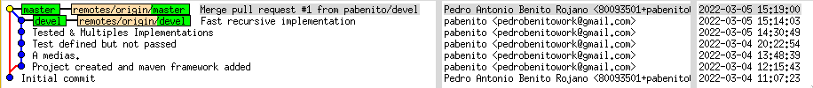

# MPS-Fibonacci
Use Maven, JUnit, Git & GitHub to create and test a project to generate fibonacci numbers.

# Many implementations of Fibonacci Tested:
- Only Iterative implementation (FibonacciIterative) and (FastRecursive) pass all test.
- The formula one is the fastest (FibonacciFormula), but do not pass the test for large numbers. This is because the formula works with decimal numbers and loses some precision.
- Simple recursive collapse the stack and thread recursive collapse both the stack and the process in the CPU, so do not pass most of the test.

# Coverage
The test cover almost all code. 
The only code that is no covered is the catch(InterruptedException e) of the thread recursive implementation (FibonacciRecursiveThread).

# Git commits tree
One develop branch (devel) was created.

